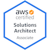

Hi there :wave: Thank you for being here! 

My name is Paula, and I'm a DevOps Engineer currently working at Covetrus. I'm a Python enthusiast and I _love_ Automating everything! In my free time, I love to pretend I'm good at embroidery and occasionally play guitar. Welcome again to my page!

### :book: Education

    <b>Kansas State University</b> – <i>Manhattan, KS</i>
    
        May 2019
    
    
  
        Bachelor of Science in Computer Science
     

      

### 👷 Skills and Qualifications
                 

### :briefcase: Relevant Experience 

    DevOps Engineer – <i>Covetrus</i>
    
        Sep 2021 – Present
    
    <ul style="font-size: .8rem; margin-top: -10px">
        <li>
        Build and maintain CI/CD pipelines using Gitlab CI, Terraform and Harness to deploy K8s applications in <b>AWS</b>.
        </li>
        <li>
        Leverage <b>Azure DevOps</b> tools and arm templates to deliver .NET apps for the company's most ambitious project to date.
        </li>
        <li>
        Serve as central point of contact of all Infrastructure-related topics for specific app-dev teams.</li>
        <li>
        Participate and collaborate in the continuous improvement of CI/CD pipelines to ensure optimal site reliability.
        </li>
    </ul>

    Embedded DevOps Engineer – <i>Capital One Trade Credit</i>
    
        Feb 2021 – Sep 2021
    
    <ul style="font-size: .8rem; margin-top: -10px">
        <li>
        Worked as an Embedded DevOps resource along with several Agile remote teams, managing several <b>Kubernetes micro-services</b> hosted on Google Cloud Platform.
        </li>
        <li>
        Maintained <b>fully automated CI/CD pipelines</b> for code deployment using Jenkins and Groovy.</li>
        <li>
        Participated in weekly Scrum meetings, and communicated daily with developers and other team members to ensure maximum productivity and efficiency.
        </li>
    </ul>

    Cloud Engineer – <i>Covetrus</i>
    
        Oct 2020 – Jan 2021
    
        <ul style="font-size: .8rem; margin-top: -10px">
        <li>
        Work as part of a cross-functional group to <b>provide customized platform solutions to fit their needs.</b>
        </li>
        <li>
        Provided software engineers and data analysts technical guidance around best practices regarding architecture, coding and performance to help boost productivity and results.
        </li>
        <li>
        <b>Automated cloud daily tasks</b>, including database IAM using AWS CLI, Python, Bash/ZSH.
        </li>
    </ul>

    System Administrator – <i>Covetrus</i>
    
        Nov 2018 – Oct 2020
    
        <ul style="font-size: .8rem; margin-top: -10px">
        <li>
        Responded to second and third level support through user-generated service Jira tickets, <b>diagnosing root causes and providing long-term solutions.</b>
        </li>
        <li>
        Deployed automated MDM processes using jamf to a previously unmanaged macOS fleet, deploying policies, workflows and patching. 
        </li>
        <li>
        Wrote, test and deploy PowerShell Scripts and Group Policies to automate and maintain the Windows Infrastructure. 
        </li>
    </ul>

    IT Support Specialist – <i>Covetrus</i>
    
        Nov 2018 – Oct 2020
    
    <ul style="font-size: .8rem; margin-top: -10px">
        <li>Managed Microsoft Active Directory and hardware asset management, imaging and deployment of workstations.</li>
        <li><b>Provided technical support for 1000+ employees</b> in 6 offices located all over the United States.
        </li>
        <li>Performed diagnostic and troubleshooting of multiple system issues, documented issues and SOPs.</li>
    </ul>

    Research Programmer – <i>Laboratory for Knowledge Discovery in Databases</i>
    
        Aug 2016 – May 2018
    
    <ul style="font-size: .8rem; margin-top: -10px">
    <li>Provided support for data mining and machine learning on a text extraction project partnered with Lawrence Livermore National Lab.
    </li>
    <li>Implemented a NoSQL Database (MongoDB) to store machine learning results and display on the Flask web app. 
    </li>
    <li>Managed the front-end user interface for customer easy access using Python (Flask), JavaScript, HTML and CSS. 
    </li>
</ul>

    Developer – <i>Beef Cattle Institute, Kansas State University</i>
    
        Aug 2016 – May 2018
    
    <ul style="font-size: .8rem; margin-top: -10px">
    <li><b>Developed an event monitoring and classification system in Python</b> for bovine infectious diseases using current Internet of Things (IoT) technology.
    </li>
    <li>Implemented a Python support for machine learning component for disease classification based on spatiotemporal pattern analysis from timestamped wearable sensor logs.
    </li>
    <li>Wrote and optimized SQL queries to retrieve and use data accordingly. 
    </li>
</ul>

 
